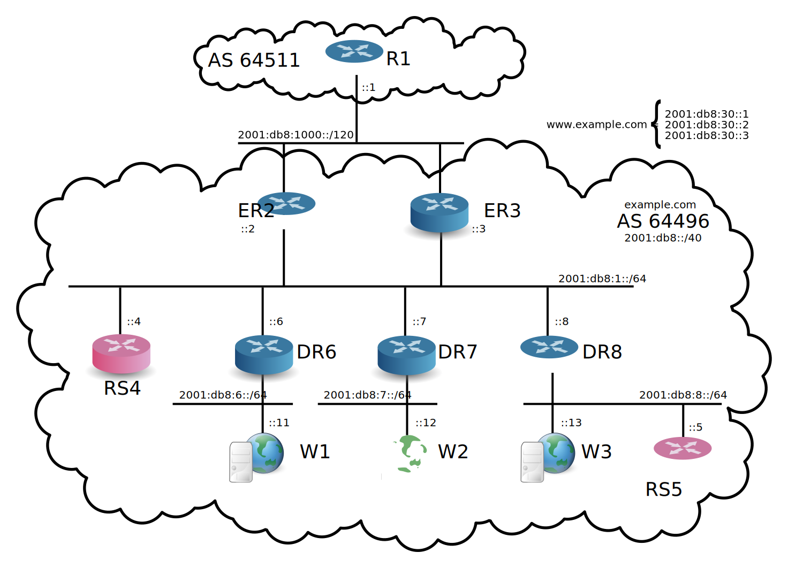

Presentation
------------

This lab shows how to use ExaBGP for high availability of a
service. Moreover, it makes use of a pair of route servers.

More details available here:
 http://vincent.bernat.im/en/blog/2013-exabgp-highavailability.html
 http://www.dailymotion.com/video/x14auqz_2013-exabgp-highavailability_tech
